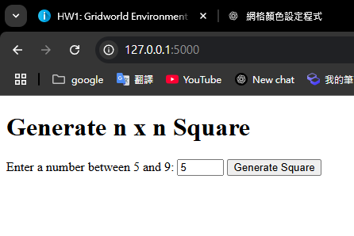

# 無標題

# 報告：使用 Flask 生成網格世界環境與互動式設定

# 一、前言

本作業旨在透過 Flask 網頁框架，建立一個動態生成的網格世界環境，供使用者互動設定路徑規劃的起點、終點與障礙物。系統的主要功能包含：

- **動態生成網格**：根據使用者輸入的 n 值（範圍 5～9）生成 n×n 的網格。
- **互動式設定**：
    - 第一次點擊尚未設定的白色格子 → 設為起點（綠色）。
    - 第二次點擊尚未設定的白色格子 → 設為終點（紅色）。
    - 之後點擊尚未設定的白色格子 → 設為障礙物（灰色）。
- **數字編號顯示**：每個格子皆依行列順序顯示唯一編號（1 至 n×n）。
- **延伸應用**：另外提供示範頁面以顯示隨機生成的策略矩陣與價值矩陣，方便後續進行強化學習（如 Q-learning）的整合。

本報告將分別說明系統架構、程式實作細節、使用流程與測試結果，並探討未來擴充方向。

---

# 二、系統架構與專案結構

整個系統以 Python 的 Flask 為後端框架，前端則採用 HTML、CSS 及少量 jQuery 處理互動。專案結構如下：

```
pgsql
複製
.
├── app.py           ← Flask 主程式，負責路由與邏輯處理
└── templates
    ├── index.html   ← 首頁：取得網格大小 n（5～9）的表單
    ├── grid.html    ← 主要網格頁面：顯示 n×n 網格、處理點擊互動及顯示編號
    └── policy.html  ← 示範頁面：顯示策略矩陣（箭頭或障礙符號）與價值矩陣（隨機數值）

```

- **app.py**：負責根據使用者輸入初始化網格資料，並利用 session 儲存各格狀態（顏色、編號），同時處理點擊事件以更新格子狀態。
- **index.html**：提供使用者輸入網格大小 n 的介面，並送出資料至後端。
- **grid.html**：透過 CSS Grid 呈現 n×n 的格子，每個格子內顯示唯一編號，並依使用者點擊改變背景顏色。
- **policy.html**：根據網格中設定的狀態，隨機生成策略（上下左右箭頭）與價值（隨機數值），並以矩陣方式顯示。

---

# 三、程式設計與實作細節

### 1. 互動邏輯說明

- **點擊順序與顏色設定**：
    - **第一次點擊**：當使用者點擊一個白色格子時，若尚未設定起點，該格將變為綠色，表示起點。
    - **第二次點擊**：若起點已設定，且使用者點擊另一個白色格子，則將該格設為紅色，表示終點。
    - **後續點擊**：若起點與終點皆已設定，使用者點擊白色格子時，將其變為灰色，表示障礙物。
    - **數字編號**：所有格子皆以行列順序編號（例如：從 1 到 n×n），以方便使用者辨識與後續計算。

### 2. 主要程式碼說明

### app.py

- **初始化階段**：
    
    在首頁（`index()`）接收使用者輸入的 n 值，並建立一個二維陣列表示網格。每個格子以字典形式儲存其狀態，初始為白色並附上編號。
    
- **網格互動處理**：
    
    在 `grid()` 路由中，接收每次點擊後提交的格子座標 (i, j)。根據當前該格顏色及起點、終點是否已設定，依序將格子顏色改為綠（起點）、紅（終點）或灰（障礙），並更新 session。
    
- **策略與價值示範**：
    
    在 `policy()` 路由中，依據網格狀態生成一個隨機策略矩陣（非障礙格子隨機顯示上下左右箭頭，障礙格顯示「X」），以及一個隨機產生的價值矩陣（非障礙格子顯示隨機浮點數，障礙格顯示「障礙」）。
    

### HTML 模板

- **index.html**：
    
    提供使用者輸入 n 值（數值介於 5～9）並送出表單，以啟動網格生成程序。
    
- **grid.html**：
    
    利用 CSS Grid 呈現 n×n 網格，每個格子以 `<button>` 呈現，內含該格的編號，並依據 session 中儲存的顏色狀態設定相對應的背景顏色（白、綠、紅、灰）。
    
- **policy.html**：
    
    以兩個並排矩陣分別顯示策略與價值，方便觀察不同狀態下的行動選擇與對應價值。
    

---

# 四、程式碼範例

以下為主要程式碼範例，供參考與說明。

### 1. app.py

```python
python
複製
from flask import Flask, render_template, request, session, redirect, url_for
import random

app = Flask(__name__)
app.secret_key = 'your_secret_key'  # 用於 session 儲存

@app.route('/', methods=['GET', 'POST'])
def index():
    """
    首頁：讓使用者輸入網格大小 n (介於 5～9)。
    """
    if request.method == 'POST':
        n = request.form.get('n', 5)
        try:
            n = int(n)
        except ValueError:
            n = 5
        n = max(5, min(9, n))

        # 初始化網格，每個 cell 記錄顏色與編號
        grid = []
        cell_index = 1
        for i in range(n):
            row = []
            for j in range(n):
                row.append({
                    'color': 'white',
                    'number': cell_index
                })
                cell_index += 1
            grid.append(row)

        # 將網格資料與設定狀態存入 session
        session['n'] = n
        session['grid'] = grid
        session['start_set'] = False
        session['end_set'] = False

        return redirect(url_for('grid'))

    return render_template('index.html')

@app.route('/grid', methods=['GET', 'POST'])
def grid():
    """
    顯示 n x n 網格，並根據點擊更新格子狀態：
      - 第一次點擊白色格子 → 起點 (綠色)
      - 第二次點擊白色格子 → 終點 (紅色)
      - 後續點擊白色格子 → 障礙物 (灰色)
    """
    if 'grid' not in session:
        return redirect(url_for('index'))

    grid = session['grid']
    n = session['n']
    start_set = session['start_set']
    end_set = session['end_set']

    if request.method == 'POST':
        i = int(request.form.get('i'))
        j = int(request.form.get('j'))

        if grid[i][j]['color'] == 'white':
            if not start_set:
                grid[i][j]['color'] = 'green'  # 設為起點
                start_set = True
            elif not end_set:
                grid[i][j]['color'] = 'red'    # 設為終點
                end_set = True
            else:
                grid[i][j]['color'] = 'gray'   # 設為障礙物

        session['grid'] = grid
        session['start_set'] = start_set
        session['end_set'] = end_set

    return render_template('grid.html', grid=grid, n=n)

@app.route('/policy')
def policy():
    """
    顯示策略矩陣與價值矩陣：
      - 策略矩陣：非障礙格子隨機顯示上下左右箭頭，障礙物標示為 "X"
      - 價值矩陣：非障礙格子顯示隨機數值，障礙格子顯示 "障礙"
    """
    if 'grid' not in session:
        return redirect(url_for('index'))

    n = session['n']
    grid = session['grid']

    directions = ['↑','↓','←','→']
    policy_matrix = []
    for i in range(n):
        row = []
        for j in range(n):
            if grid[i][j]['color'] == 'gray':
                row.append('X')
            else:
                row.append(random.choice(directions))
        policy_matrix.append(row)

    value_matrix = []
    for i in range(n):
        row = []
        for j in range(n):
            if grid[i][j]['color'] == 'gray':
                row.append('障礙')
            else:
                val = round(random.uniform(-5, 5), 2)
                row.append(val)
        value_matrix.append(row)

    return render_template('policy.html',
                           n=n,
                           policy_matrix=policy_matrix,
                           value_matrix=value_matrix)

if __name__ == '__main__':
    app.run(debug=True)

```

### 2. templates/index.html

```html
html
複製
<!DOCTYPE html>
<html>
<head>
    <meta charset="utf-8">
    <title>網格生成器</title>
</head>
<body>
    <h1>產生 n x n 網格</h1>
    <form method="POST">
        <label>請輸入 5 至 9 之間的數字：</label>
        <input type="number" name="n" min="5" max="9" required>
        <button type="submit">生成網格</button>
    </form>
</body>
</html>

```

### 3. templates/grid.html

```html
html
複製
<!DOCTYPE html>
<html>
<head>
    <meta charset="utf-8">
    <title>網格世界</title>
    <style>
        .grid {
            display: grid;
            grid-template-columns: repeat({{n}}, 60px);
            grid-gap: 5px;
        }
        .cell {
            width: 60px;
            height: 60px;
            text-align: center;
            line-height: 60px;
            border: 1px solid #ccc;
            cursor: pointer;
            font-weight: bold;
        }
        .white { background-color: white; }
        .green { background-color: green; color: white; }
        .red   { background-color: red;   color: white; }
        .gray  { background-color: gray;  color: white; }
    </style>
</head>
<body>
    <h1>{{n}} x {{n}} 網格</h1>
    <p>
      點擊規則：<br>
      1. 第一次點擊白色格子 → 起點 (綠色)<br>
      2. 第二次點擊白色格子 → 終點 (紅色)<br>
      3. 後續點擊白色格子 → 障礙物 (灰色)
    </p>

    <div class="grid">
        
            
                <form method="POST" style="margin:0; padding:0;">
                    <input type="hidden" name="i" value="{{ i }}">
                    <input type="hidden" name="j" value="{{ j }}">
                    <button type="submit" class="cell {{ grid[i][j].color }}">
                        {{ grid[i][j].number }}
                    </button>
                </form>
            
        
    </div>

    <p>
      <a href="{{ url_for('policy') }}">前往顯示策略與價值</a>
    </p>
</body>
</html>

```

### 4. templates/policy.html

```html
html
複製
<!DOCTYPE html>
<html>
<head>
    <meta charset="utf-8">
    <title>策略與價值</title>
    <style>
        .matrix-container {
            display: flex;
            gap: 50px;
        }
        .matrix {
            display: grid;
            grid-template-columns: repeat({{n}}, 60px);
            grid-gap: 5px;
            margin-top: 20px;
        }
        .cell {
            width: 60px;
            height: 60px;
            text-align: center;
            line-height: 60px;
            border: 1px solid #ccc;
            font-weight: bold;
        }
    </style>
</head>
<body>
    <h1>策略與價值</h1>
    <div class="matrix-container">
        <!-- 策略矩陣 -->
        <div>
            <h2>策略矩陣</h2>
            <div class="matrix">
                
                    
                        <div class="cell">{{ policy_matrix[i][j] }}</div>
                    
                
            </div>
        </div>

        <!-- 價值矩陣 -->
        <div>
            <h2>價值矩陣</h2>
            <div class="matrix">
                
                    
                        <div class="cell">{{ value_matrix[i][j] }}</div>
                    
                
            </div>
        </div>
    </div>

    <p><a href="{{ url_for('grid') }}">返回網格</a></p>
</body>
</html>

```

---

# 五、使用流程與測試結果

1. **啟動應用程式**
    - 在終端機中執行 `python app.py`，Flask 伺服器將在預設埠 5000 運行。
    - 開啟瀏覽器，進入 http://127.0.0.1:5000/。
2. **生成網格**
    - 在首頁輸入網格大小 n（例如 5 至 9 之間的數字），並按下生成按鈕。
    - 系統會根據輸入數值初始化一個 n×n 的網格，每個格子均顯示唯一編號。
    
    
    
3. **互動式設定**
    - 進入網格頁面後，首次點擊一個白色格子，該格變為綠色，表示起點。
    - 第二次點擊另一個白色格子，該格變為紅色，表示終點。
    - 隨後點擊其他白色格子，則變為灰色，表示障礙物。
    - 點擊已變色的格子不會改變其狀態。
    
    
    
4. **策略與價值展示**
    - 點擊頁面下方的連結前往策略頁面，可看到：
        - **策略矩陣**：非障礙格子隨機顯示箭頭（↑、↓、←、→），障礙物顯示「X」。
        - **價值矩陣**：非障礙格子顯示隨機產生的數值，障礙物顯示「障礙」。
    
    
    

[錄製_2025_03_23_23_36_48_471.mp4](%E9%8C%84%E8%A3%BD_2025_03_23_23_36_48_471.mp4)